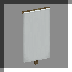
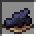
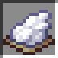
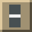

this blog is not complete yet, still to finish writing up

<link rel="stylesheet" href="./assets/interactive-generator.css">

# Cistercian Numerals Minecraft Banners

My repo: [https://github.com/JNCressey/Cistercian-Numerals-Minecraft-Banners](https://github.com/JNCressey/Cistercian-Numerals-Minecraft-Banners)

## Intro

Cistercian numerals are symbols that can represent the numbers 1-9999, invented by Cistercian monks in the early 13th century. 

This Numberphile video explains how they work: [Youtube: 
The Forgotten Number System - Numberphile](https://www.youtube.com/watch?v=9p55Qgt7Ciw)

They act as a compact version of base-10, with the four corners of the glyph representing the four digits. The order of the digits is like a backwards "Z" pattern with the top-right corner representing the units place. 

	
The form of each digit

	<!-- todo alt text -->
	

	
Some examples of Cistercian numerals

	<!-- todo alt text -->
	

The compact design of the numerals can be useful in Minecraft. Usually, one way of showing numbers in Minecraft is to use banners, with one Arabic numeral per banner.

I designed a set of banner patterns that resemble a half of a Cistercian numeral, which allows two banners to represent a Cistercian numeral which is equivellent to four base-10 digits.

	
Some examples of my Minecraft banners designs

	<!-- todo alt text -->
	

## Web-Browser Based Interactive Generator

I made a webpage that can generate the required banner patterns for an input number. I programmed it by writing javascript modules.

There is a core module which generates the data of the required sequence of banner patterns. I made this follow the below flowchart by splitting it into methods.
- I labelled each point of the main flowchart where flow converges.
	- From each, I wrote a method that starts at the labelled point and performs the actions and branching of the flowchart. But when it reaches another labelled point, it returns with a call for the corresponding next method.
- I made a method that implements the auxiliary flowchart, that the other main methods can use as an action for the relevant nodes of the flowchart.

I wrote a module that draws the result of what the Cistercian numeral is supposed to look like. It draws it on a canvas element. To draw each digit, I made a method that can be given an origin and set of directions so that it draws the digit with the correct rotation/reflection and position. It draws the digit by defining a square of four points and connecting the required points acording to the digit's face value.

I wrote a module that draws a preview of the banner on a canvas element. It iterates over the sequence of banner patterns, provided by the other module, and calls a function that draws that pattern step.

	

		<h2>Interactive Generator</h2>
		
		<noscript>
			
The interactive generator requires Javascript enabled to work. Showing an example output instead.

		</noscript>
		
		<form id="generatorForm">
			<label for="numberInput">Number Input:</label>
			<input id="numberInput" name="numberInput" type="number" required min="0" max="9999" value="2026" disabled>
			
			 
			
			<label> Background Colour:</label>
			<select id="backgroundColor" name="backgroundColor" required disabled>
				<noscript><option value="white">White</option></noscript>
			</select>
			 
			
			<label>Foreground Colour:</label>
			<select id="foregroundColor" name="foregroundColor" required disabled>
				<noscript><option value="black" >Black</option></noscript>
			</select>
			 
			
			<button type="submit" disabled>Generate banner patterns</button>
		</form>
		
		
		
The following output shows what the selected Cistercian numeral is supposed to look like. The two banners are a representation of the left and right sides of the numeral.

		
		
The command may be too long for chat, so you might need to use a command block.

		
		<h3 id="outputNumeralHeading">Output<noscript>: for 2026</noscript></h3>
		
		

			
The cistercian numeral

			

				<canvas id="cistercianNumeralOutput" width="200" height="400">
					
				</canvas>
			

		

		
		
		

			

				<h4 class="bannerSideHeading">Left Banner<noscript>: 2020</noscript></h3>
				
				

					
 Banner preview

					

						<canvas id="bannerPreviewLeft" class="bannerPreview" width="200" height="400">
							
						</canvas>
					

				

				
				<h5>Give command</h5>
				<textarea id="giveCommandLeft" class="giveCommand">/give @p minecraft:white_banner[banner_patterns=[{pattern:half_horizontal,color:black},{pattern:stripe_top,color:white},{pattern:half_horizontal_bottom,color:black},{pattern:stripe_bottom,color:white},{pattern:stripe_middle,color:white},{pattern:stripe_right,color:black}]] 1</textarea>
				
				 
				
				<button id="copyCommandLeft" class="copyCommandButton" disabled>Copy Command</button>
				
				
				<h5>Crafting/Loom steps</h5>
				

					<table>
						<noscript>
							<tr><th>Start.</th>
								<td>White Banner</td>
								<td></td>
								<td></td>
								<td></td>
							</tr>
							<tr><th>Step 1.</th>
								<td>Black Dye</td>
								<td></td>
								<td>Per Fess</td>
								<td></td>
							</tr>
							<tr><th>Step 2.</th>
								<td>White Dye</td>
								<td></td>
								<td>Chief</td>
								<td></td>
							</tr>
							<tr><th>Step 3.</th>
								<td>Black Dye</td>
								<td></td>
								<td>Per Fess Inverted</td>
								<td></td>
							</tr>
							<tr><th>Step 4.</th>
								<td>White Dye</td>
								<td></td>
								<td>Base</td>
								<td></td>
							</tr>
							<tr><th>Step 5.</th>
								<td>White Dye</td>
								<td></td>
								<td>Fess</td>
								<td></td>
							</tr>
							<tr><th>Step 6.</th>
								<td>Black Dye</td>
								<td></td>
								<td>Pale Sinister</td>
								<td></td>
							</tr>
						</noscript>
					</table>
				

			

			
			

				<h4 class="bannerSideHeading">Right Banner<noscript>: 6</noscript></h3>
				
				

					
 Banner preview

					

						<canvas id="bannerPreviewRight" class="bannerPreview" width="200" height="400">
							
						</canvas>
					

				

				
				<h5>Give command</h5>
				<textarea id="giveCommandRight" class="giveCommand">/give @p minecraft:white_banner[banner_patterns=[{pattern:stripe_right,color:black},{pattern:half_horizontal_bottom,color:white},{pattern:stripe_middle,color:white},{pattern:stripe_left,color:black}]] 1</textarea>
				
				 
				
				<button id="copyCommandRight" class="copyCommandButton" disabled>Copy Command</button>
				
				
				
				<h5>Crafting/Loom steps</h5>
				

					<table>
						<noscript>
							<tr><th>Start.</th>
								<td>White Banner</td>
								<td></td>
								<td></td>
								<td></td>
							</tr>
							<tr><th>Step 1.</th>
								<td>Black Dye</td>
								<td></td>
								<td>Pale Sinister</td>
								<td></td>
							</tr>
							<tr><th>Step 2.</th>
								<td>White Dye</td>
								<td></td>
								<td>Per Fess Inverted</td>
								<td></td>
							</tr>
							<tr><th>Step 3.</th>
								<td>White Dye</td>
								<td></td>
								<td>Fess</td>
								<td></td>
							</tr>
							<tr><th>Step 4.</th>
								<td>Black Dye</td>
								<td></td>
								<td>Pale Dexter</td>
								<td></td>
							</tr>
						</noscript>
					</table>
				

			

		

	

## Flowchart

I made a flowchart so that a player can follow it as crafting instructions, without using the interactive generator, with just the flowchart images as references.

To use the flow chart, you first need to decide the digits you will make:

1. Choose a side of the numeral to make:
	- the hundreds and units
	- or the thousands and tens.
2. Choose two digits. Call them digit A and digit B. With A being the larger digit, from their digit values, ignoring place value. (eg, for both 2080 and 8020: A=8 and B=2.)

Start at the top of the main flowchart.

When the main flowchart tells you to use the auxiliary flowchart, follow the steps on the other image for the single digit that the main flowchart told you to use. Then return to the main flowchart where you left from.

	
 Main flowchart 

	<!-- todo alt text -->
	

	
 Auxiliary flowchart 

	<!-- todo alt text -->
	

I used UMLet to draw the flowcharts.

---

*Minecraft is a trademark of Mojang/Microsoft. This site is not affiliated with or endorsed by Mojang or Microsoft.*
