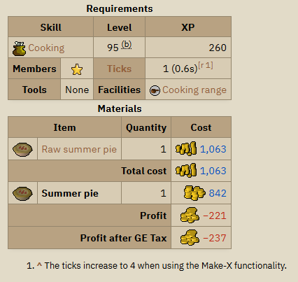
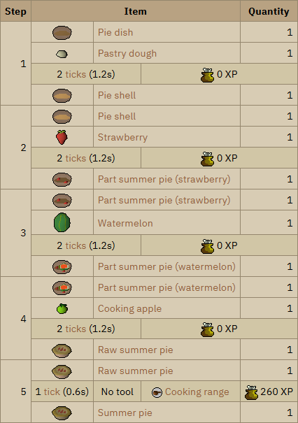
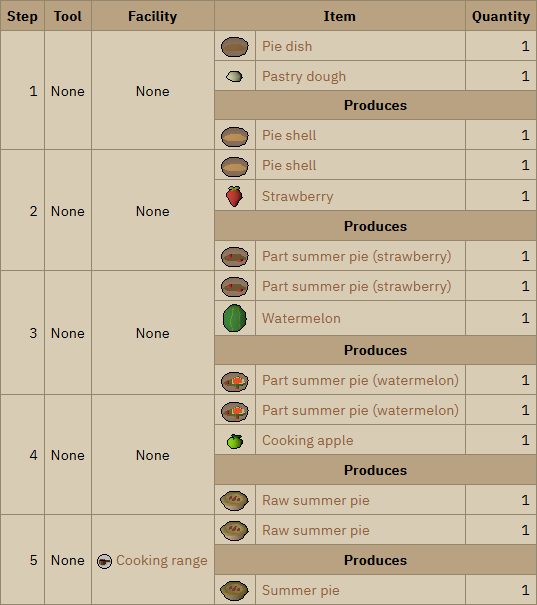
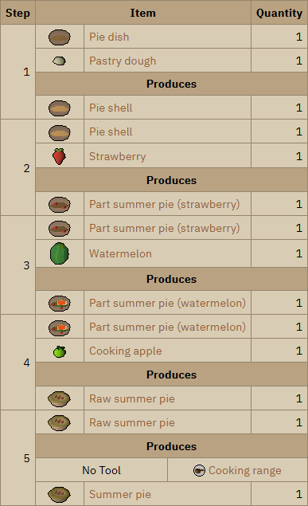
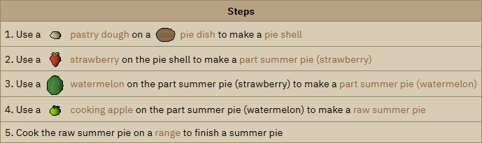
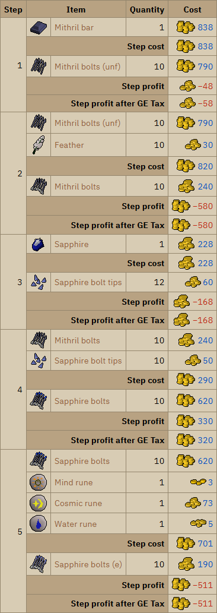
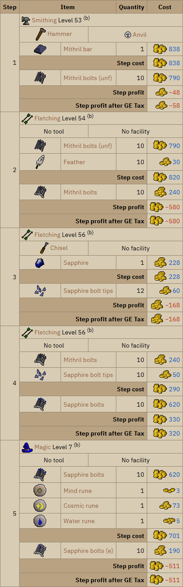
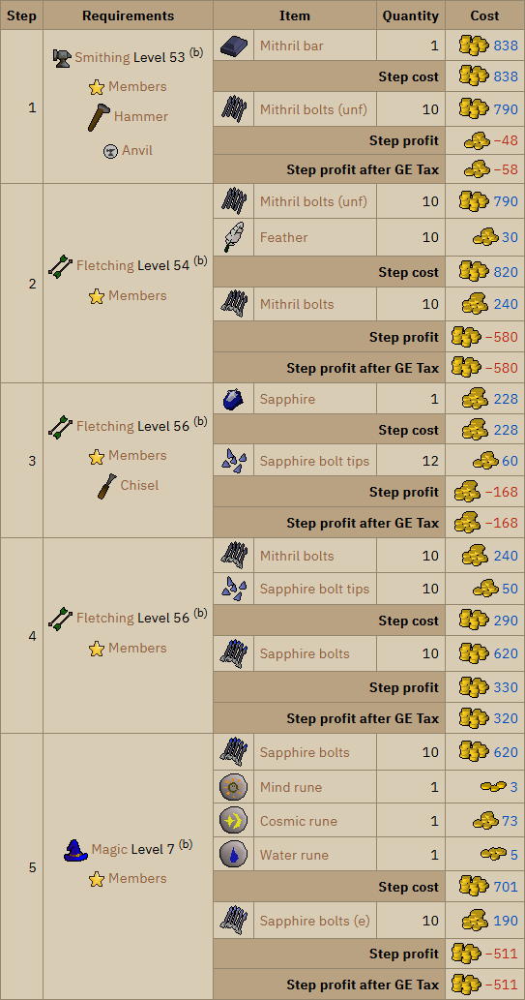
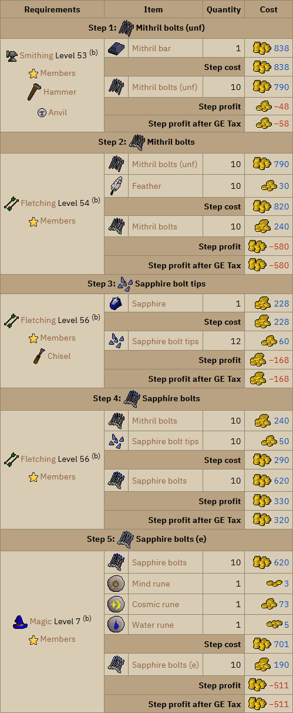

# Designing a summary table for the profit/loss at each step of recipes - Old School RuneScape Wiki

On the Old School RuneScape wiki, articles about items that can be created show table with details about a creation recipe, produced using a wiki template called `Recipe`, such as the following for *Summer pie*:

However, many items have multiple steps in their creation. I noticed that the information for each of the steps was often spread across multiple articles - each item's article having the details of the final step that creates it. For example, the above table that is from the article of the *Summer pie* simply shows details about the final step of cooking a *Raw summer pie*.

I decided I would make a table to collect the information together.

At first, I was unsure which information should be included in the table. If it misses something essential, then people will still need to go to multiple pages. But, if it contains all the information, then it would be too cluttered.

## Prototype Designs

### Design 1

This was my first design attempt to summarise the steps of a creation process.

The information I included for each step were:
* the materials and product
* the time it takes to perform (measure in game ticks)
* the experience reward
* the tools and facilities, if required

For the information that wasn't about items, I placed them in a row that separated the materials from the product. I didn't want to put each part of that information as separate columns, as that would take up a lot of horizontal width.

### Design 2

I decided that the times and experience rewards were causing too much clutter. 

With fewer fields of extra information to present, I considered putting them into their own columns for design 2.

### Design 3

A lot of the steps for the example of summer pie required no tool or facility, a lot of space seemed wasted just saying 'none'. So, for design 3, I moved these requirements back to between the materials and product, but left a row out if it was only saying 'none'.

Making the tool and facility cells equally share the horizontal space was difficult, since the boundary wouldn't be lined up with any of the other columns. I achieved it by adding an extra column, so there would be 4 columns. 
* On rows with the tool and facility, I would have the first two merged for the tool and the other two merged for the facility.
* On rows with the items, I would merge the two middle cells for the name of the item.

### Design 4

Since I was using the example of the summer pie, all the intermediate steps produced untradable items, so adding item prices wouldn't be useful for this example. For such an example, it seemed that the only usefulness from having the table of steps was to act as instructions for how to make the pie. 

The `Instructions` template that already exists seemed to do a decent job of listing such instructions:

So I decided that for such items, where the intermediate products are untradable, the articles can be left using the `Instructions` template. And with this table I will focus on a more useful domain of information: comparing the profit/loss you get from performing the various steps.

I started by simply taking the materials section from the existing `Recipe` template, and placing them next to a column with step numbers.

### Design 5

I added the requirements for each step in a similar way to I had in design 3.

### Design 6

I didn't like how I was displaying the requirements for a step.

The fact that those cells occupied the same space vertically as the items caused a few problems:
* It seems too cluttered and it would be confusing to add headings for the various requirement fields.
* The way that I using an extra pretend column for alignment made the markup not be a good semantic representation of the content, and it would also be confusing to other people to edit.

I had the idea to move the requirements into a combined list in a large cell to the side. This allowed listing many requirements without using a lot of horizontal space over separate columns for each requirement.

### Design 7

I didn't quite like how the labels for the step numbers were occupying a column contributing to the horizontal width. So, for the final design, I decided to move the step numbers to be as header rows.

With them as header rows, I could also have space to give titles to the steps. So, I decided to put the image and name of the product of a step in its header.

*Created using intellectual property belonging to Jagex Limited under the terms of [Jagex's Fan Content Policy](https://legal.jagex.com/docs/policies/fan-content-policy).
This content is not endorsed by or affiliated with Jagex.*
