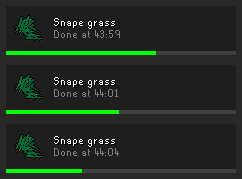

# Plugin for RuneLite: Item Respawn Timer

My repo: [https://github.com/JNCressey/item-respawn-timer](https://github.com/JNCressey/item-respawn-timer)

I made a plugin for the RuneLite client, a client for the game Old School RuneScape, that shows timers for respawning items.

## Respawning Items

Some items in RuneScape will respawn in set locations on the ground. Having a timer for when they respawn is useful when the player is collecting these items.

### Timing formula

The time it takes for an item to respawn is variable, depending on the number of players currently in that game world. My plugin calculates the amount of time an item will take to respawn to predict when it will respawn.

Predictions can be slightly off. Because the respawn time depends on how many players are currently in the world, and the world populations are only periodically sent to the client.

## Timers Model

To time each item I created an object that stores the item information, the location in the game world, and timestamps for the timer.

I store the active timers as a list, ordered by the time they are due to respawn.

So that the side-panel can show completed timers, informing the player to go collect the item, the timers aren't deleted at the respawn due time. The plugin keeps the timers until after twice the respawn duration if the player doesn't return to the spawn location.

## Overlay

An overlay shows count-down dials (like there are for the Mining and Woodcutting plugins).

To implement this, I extended RuneLite's `Overlay` object and implemented the `render` method. For each timer corresponding to a location within the player's view, I used RuneLite's `ProgressPieComponent` to draw the count-down.

### Tables

Some items spawn on top of a table instead of on the ground. So the position I give to `ProgressPieComponent`, for such an item, needs to be raised up to show at the height of the table instead of being at ground level.

I was able to get the height offset for an item, beforehand, when the client sees an item on a table. I then saved the height offset in a HashMap to use when drawing the count-down.

### A config option to turn off the overlay

I made a config option for the plugin for the user to turn off the overlay. This disables the count-down dials being shown in the game world, but still allows the side panel to list timers.

## Panel

A side-panel shows a list of timers (like the Time Tracking plugin). 

Each timer in the list shows the following information:
- The item icon and name.
- The timestamp of when the item will respawn is shown as minutes and seconds.
- The progress bar fills with green until the respawn time.
- After you see the item, the timer is deleted from the panel.
  - If you don't return to the spawn location, the progress bar will fill a second time with grey as an indicator of how stale the information is.
  - After the stale bar fills the timer is deleted.
- If you're in a different world to the spawn, the world number will be shown on the timer.

I implemented this by reusing the `TimeablePanel` class from the Time Tracking plugin. So that the behaviour of the class would be unafected by updates to the Time Tracking plugin, I copied the `TimeablePanel.java` file along with its redistribution comment attributing the original authors. I then extended the class with methods specific to my timers.

The side-panel contains a list of these panels, one for each active timer. Each second I add or remove timer's panels from the side-panel, and update the progress bar with the current progress.

When adding new timers, I add them in order of due time which is easily produced from the timer model having the list already ordered this way.

---

*RuneScape and Old School RuneScape is a trademark of Jagex Limited. RuneScape game content, screenshots, and related asets are the property of Jagex Limited. This site is not affiliated with or endorsed by Jagex.*
